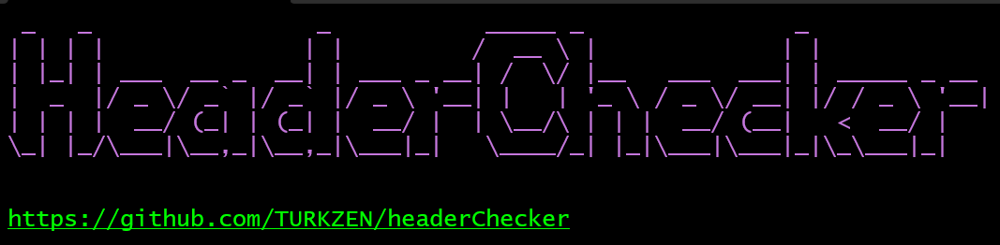

<h2 align="center"><u>headerChecker</u></h2>

 
    
    
    
    
    

### [+] Description
headerChecker was created to make it easier to check HTTP Security Headers of a web application and to take screenshots.

### [+] Installation
 - `https://github.com/TURKZEN/headerChecker.git`

### [+] Usage
 - `cd headerChecker`
 - `python headerChecker.py [TXT_FILE]`
   
### [+] Find me on 

